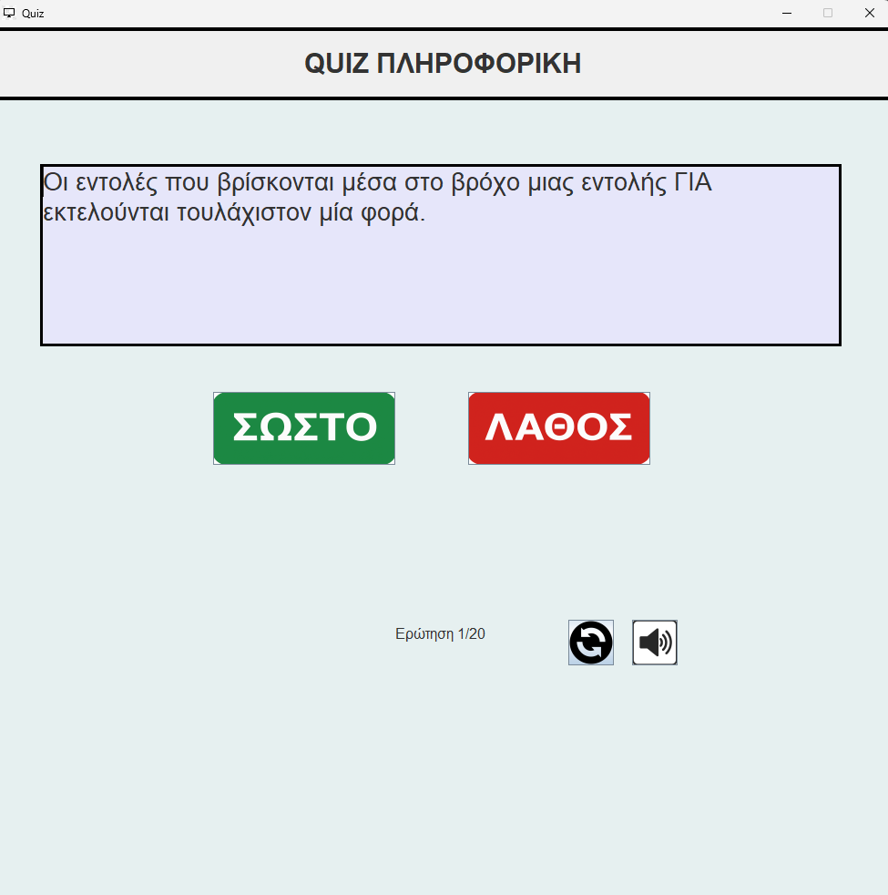
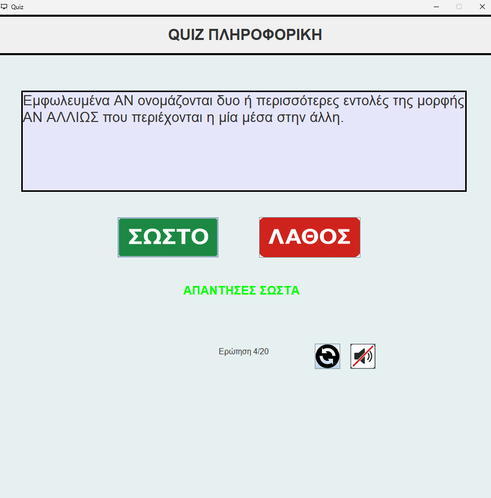

  

<h1 align="center">🍓 Quizberry 🍓</h1>

A True/False Quiz App for Informatics (Πληροφορική) – Greek National Exams

---

# Quizberry – Informatics Quiz (Πανελλήνιες / Greek National Exams)

**Quizberry** is an educational **True/False quiz application** built with **Java**, created for students preparing for the **Greek National Exams (Πανελλήνιες) in Informatics (A.E.P.P.)**.  
The project contains a **database of 200 questions** (in Greek) stored in a JSON file, covering key Informatics topics.  

Each game selects **20 random questions** out of the 200, making every playthrough unique and challenging.  

## Features ✨
- ✅ **True/False format** for quick learning.  
- 🔊 **Sound feedback** for both correct and wrong answers.  
- 🎚 **Mute/Unmute button** to toggle sound anytime.  
- 🎲 **Randomized quiz session**: 20 questions are selected randomly from the 200.  
- 🏆 **Score display**: shows how many correct answers you got out of 20 (e.g., *15/20*).  
- 🔄 **Restart button** to start a new session immediately.  

## Screenshots 📸
## Screenshots

## How It Works ⚙️
1. The app loads **200 Informatics questions** from the JSON file.  
2. On each playthrough, **20 random questions** are selected.  
3. The player answers **True/False** for each question.  
4. Immediate **sound feedback** is given:  
   - ✅ Correct → plays a "correct" sound.  
   - ❌ Wrong → plays a "wrong" sound.  
5. A **mute/unmute button** lets the player disable sounds anytime.  
6. At the end, the player sees their **score out of 20**.  
7. The **Restart** button allows for a new random session.  

## Technologies Used 🛠
- **Java** (main application)  
- **JSON** (question storage)  
- **Java Sound API** (sound effects)  

